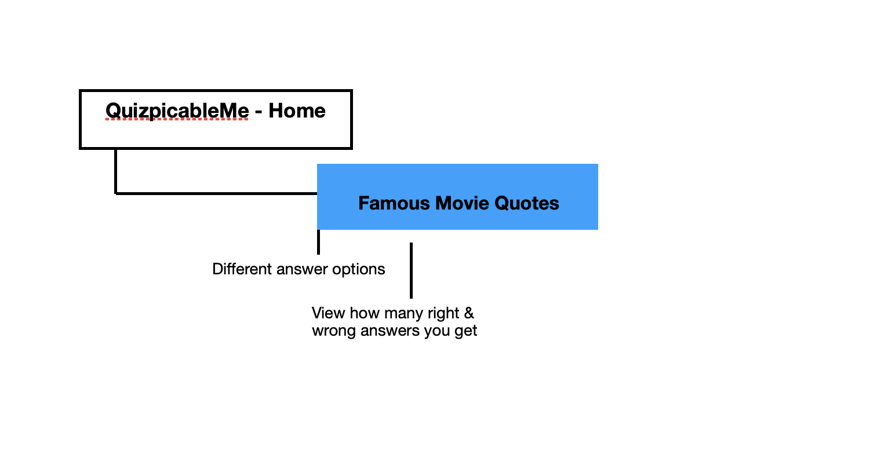

# QuizpicableMe

## Content

## Introduction

This is an interactive trivia quiz game where the users guess the movie from where the movie quote is famous from. It is designed to be easy to use and navigate through. 

This is the second project out of four Milestone Projects to be completed in Full Stack Web Development Program at Code Institute. 

The main requirements is to design, develop and implement a front-end web application by using **HTML**, **CSS** and **JavaScript**. 

## UX 

### Project Goals
The goal of QuizpicableMe is to provide a web-based interactive game by users getting different options while guessing the quote of the movie. 

### Player Goals
The user is looking for:
- An entertaining game to play
- Easy webdesign that needs no little to no instructions

### Developer Goals
The developer is looking for:
- Creating a game that easy and they would like to play themselves
- Showing of their variety of development skills, using recently learned languages

### User Stories
**As a player - I want to:**

1. Easily navigate through the game application. 
2. Keep track on how many questions I have answered. 
3. Easily see how much time I have left on each question. 
4. Get visual feedback on my answers, to see if I was correct. 
5. Be able to choose what to do at the end of the game, if I would like to replay. 
6. Be able to see how many correct and incorrect answers I got at the end of the game. 

***

### Development Planes 

Strategy
-

Roles 
- New players 
- Current players 

Demographic
- Movie lovers 
- Ages 12 years and up
- People who loves quizzes

Scope
-

- **Content Requirements**
     - The user will be looking for:
          - Engaging content
          - Easy navigation
          - Easy play interface
- **Functionality Requirements**
     - The user will be able to:
          - Navigate easily
          - Play with ease
          - See end score

Structure
-

The site was easily structured by using one page only application of how the user could easily navigate through the site. 

See result:

Skeleton
-

